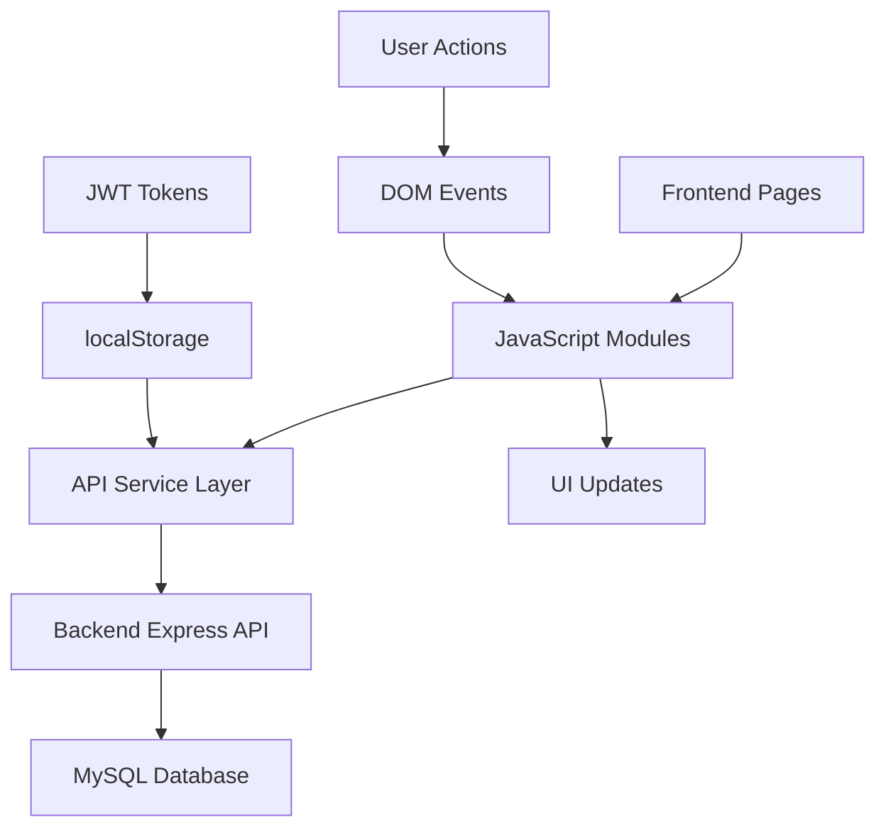

# Design Document: Frontend Integration and Enhancement

## Overview

This design outlines the development of a comprehensive frontend interface for the Wellness Challenge Web Application. The frontend will enhance the existing basic authentication and dashboard functionality, integrating seamlessly with the established backend API to provide users with a rich, interactive wellness management experience.

The design builds upon the existing foundation:
- Basic login/register functionality with JWT authentication
- Simple dashboard with challenge listing
- Backend API with comprehensive endpoints for challenges, gamification, and user management

## Architecture

### Frontend Architecture Pattern
The frontend follows a **modular JavaScript architecture** with separation of concerns:

```
frontend/
├── pages/           # HTML pages
├── js/
│   ├── modules/     # Feature-specific modules
│   ├── components/  # Reusable UI components  
│   ├── services/    # API communication layer
│   └── utils/       # Shared utilities
├── css/
│   ├── components/  # Component-specific styles
│   └── pages/       # Page-specific styles
└── assets/          # Images, icons, etc.
```

### Communication Flow


### State Management
- **Authentication State**: JWT tokens stored in localStorage with automatic refresh
- **Application State**: In-memory JavaScript objects for current session data
- **UI State**: DOM-based state management with event-driven updates

## Components and Interfaces

### 1. Authentication System Enhancement

**Enhanced Login Component**
```javascript
class LoginManager {
  async login(credentials)
  async refreshToken()
  logout()
  isAuthenticated()
  getUser()
}
```

**Features:**
- Form validation with real-time feedback
- Loading states during API calls
- Automatic token refresh on expiration
- Remember me functionality
- Password visibility toggle

**Enhanced Registration Component**
```javascript
class RegistrationManager {
  async register(userData)
  validateForm(formData)
  checkEmailAvailability(email)
}
```

**Features:**
- Progressive form validation
- Password strength indicator
- Email availability checking
- Terms and conditions acceptance

### 2. Dashboard System

**Main Dashboard Component**
```javascript
class Dashboard {
  async loadUserData()
  async loadChallenges()
  async loadGameStats()
  renderWelcomeSection()
  renderQuickStats()
  renderRecentActivity()
}
```

**Dashboard Sections:**
- **Header**: User welcome, points display, logout button
- **Quick Stats**: Total challenges, completed, points earned
- **Challenge Overview**: Recent challenges, progress indicators
- **Gamification Panel**: Spells, ingredients, resources summary
- **Quick Actions**: Create challenge, view progress, access shop

### 3. Challenge Management System

**Challenge Manager Component**
```javascript
class ChallengeManager {
  async getAllChallenges()
  async createChallenge(challengeData)
  async updateChallenge(id, data)
  async deleteChallenge(id)
  async completeChallenge(id, completionData)
  filterChallenges(criteria)
  sortChallenges(method)
}
```

**Challenge Features:**
- **Create/Edit Form**: Rich text editor, category selection, point assignment
- **Challenge Cards**: Visual progress, difficulty indicators, action buttons
- **Filtering**: By category, difficulty, completion status, creator
- **Sorting**: By date, points, popularity, completion rate

### 4. Gamification Integration

**Gamification Manager**
```javascript
class GamificationManager {
  async getSpells()
  async getIngredients() 
  async getResources()
  async getUserInventory()
  async purchaseItem(itemId, itemType)
  async useSpell(spellId)
}
```

**Gamification Features:**
- **Spell Shop**: Browse available spells, purchase with points
- **Ingredient Collection**: View collected ingredients, usage tracking
- **Resource Management**: Manage owned resources, trading system
- **Achievement System**: Badges, milestones, progress tracking

### 5. Progress Tracking System

**Progress Tracker Component**
```javascript
class ProgressTracker {
  async getUserProgress()
  async getChallengeHistory()
  generateProgressCharts()
  calculateStreaks()
  getAchievements()
}
```

**Progress Features:**
- **Visual Charts**: Progress over time, category breakdowns
- **Streak Tracking**: Daily/weekly challenge completion streaks
- **Achievement Display**: Earned badges, milestone celebrations
- **Statistics**: Detailed analytics on user performance

### 6. Review and Rating System

**Review Manager Component**
```javascript
class ReviewManager {
  async submitReview(challengeId, reviewData)
  async getChallengeReviews(challengeId)
  async updateReview(reviewId, data)
  calculateAverageRating(reviews)
  renderReviewForm()
}
```

**Review Features:**
- **Star Rating System**: 1-5 star ratings with hover effects
- **Review Comments**: Rich text reviews with character limits
- **Review Display**: Paginated reviews with sorting options
- **Review Moderation**: Report inappropriate content

## Data Models

### Frontend Data Structures

**User Model**
```javascript
const User = {
  id: Number,
  username: String,
  email: String,
  skillpoints: Number,
  created_at: Date,
  avatar_url: String
}
```

**Challenge Model**
```javascript
const Challenge = {
  id: Number,
  title: String,
  description: String,
  skillpoints: Number,
  creator_id: Number,
  category: String,
  difficulty: String,
  created_at: Date,
  completion_count: Number,
  average_rating: Number
}
```

**Completion Model**
```javascript
const Completion = {
  id: Number,
  challenge_id: Number,
  user_id: Number,
  completed: Boolean,
  notes: String,
  review_amt: Number,
  creation_date: Date
}
```

**Gamification Models**
```javascript
const Spell = {
  id: Number,
  name: String,
  description: String,
  skillpoint_required: Number,
  effect: String
}

const Ingredient = {
  id: Number,
  name: String,
  rarity: String,
  effect: String
}

const Resource = {
  id: Number,
  name: String,
  type: String,
  value: Number
}
```

### API Integration Layer

**API Service Class**
```javascript
class APIService {
  constructor() {
    this.baseURL = 'http://localhost:3000/api'
    this.token = localStorage.getItem('accessToken')
  }

  // Authentication
  async login(credentials)
  async register(userData)
  async refreshToken()

  // Challenges
  async getChallenges()
  async createChallenge(data)
  async updateChallenge(id, data)
  async deleteChallenge(id)
  async completeChallenge(id, completionData)

  // Gamification
  async getSpells()
  async getIngredients()
  async getResources()
  async getUserResources(userId)

  // Reviews
  async getReviews(challengeId)
  async submitReview(challengeId, reviewData)

  // Utility methods
  async makeRequest(endpoint, options)
  handleResponse(response)
  handleError(error)
}
```

## Correctness Properties

*A property is a characteristic or behavior that should hold true across all valid executions of a system—essentially, a formal statement about what the system should do. Properties serve as the bridge between human-readable specifications and machine-verifiable correctness guarantees.*

Based on the prework analysis, I've identified properties that can be tested across all inputs and examples that test specific scenarios. Here are the key correctness properties:

### Authentication Properties

**Property 1: Form Loading States**
*For any* form submission in the authentication system, a loading indicator should be displayed during the API request
**Validates: Requirements 1.2**

**Property 2: Form Validation Feedback**
*For any* invalid form data, the system should highlight the problematic fields with appropriate error messages
**Validates: Requirements 1.3, 8.3**

**Property 3: Registration Success Flow**
*For any* successful registration, the system should show confirmation and redirect to the login page
**Validates: Requirements 1.4**

**Property 4: Token Refresh Behavior**
*For any* expired access token, the system should automatically attempt refresh using the refresh token
**Validates: Requirements 2.1**

**Property 5: Session Continuity**
*For any* successful token refresh, the user's session should continue transparently without interruption
**Validates: Requirements 2.2**

**Property 6: Refresh Failure Handling**
*For any* failed token refresh, the system should redirect to login with a session expired message
**Validates: Requirements 2.3**

**Property 7: Inactivity Warnings**
*For any* user inactive for extended periods, the system should warn before automatic logout
**Validates: Requirements 2.4**

### Dashboard Properties

**Property 8: Dashboard User Information**
*For any* dashboard access, the system should display the user's name and current points
**Validates: Requirements 3.1**

**Property 9: Challenge Statistics Display**
*For any* dashboard load, the system should show accurate challenge statistics including completed, in-progress, and available counts
**Validates: Requirements 3.2**

**Property 10: Challenge Organization**
*For any* challenge display, challenges should be organized in categories with progress indicators
**Validates: Requirements 3.3**

**Property 11: Challenge Detail Information**
*For any* challenge selection, the system should display complete information including description, points value, and completion requirements
**Validates: Requirements 3.4**

### Challenge Management Properties

**Property 12: Challenge Data Validation**
*For any* valid challenge submission, the system should validate the data and send it to the Backend API
**Validates: Requirements 4.2**

**Property 13: Challenge Management Options**
*For any* user-created challenge, the system should provide edit and delete options
**Validates: Requirements 4.3**

**Property 14: Challenge Completion Updates**
*For any* challenge completion, the system should immediately update the completion status and award points
**Validates: Requirements 4.4**

**Property 15: Challenge Filtering**
*For any* filter criteria applied to challenges, the system should return only challenges matching those criteria
**Validates: Requirements 4.5**

### Gamification Properties

**Property 16: Gamification Item Display**
*For any* gamification section access, the system should display all available spells, ingredients, and resources
**Validates: Requirements 5.1**

**Property 17: Purchase Eligibility**
*For any* user with sufficient points, the system should enable purchasing of gamification items
**Validates: Requirements 5.2**

**Property 18: Inventory Display**
*For any* inventory access, the system should show all owned spells, ingredients, and resources
**Validates: Requirements 5.3**

**Property 19: Gamification Data Sync**
*For any* gamification operation, the system should synchronize data with the Backend API
**Validates: Requirements 5.5**

### Review System Properties

**Property 20: Review Option Availability**
*For any* completed challenge, the system should offer the option to leave a review and rating
**Validates: Requirements 6.1**

**Property 21: Review Submission Process**
*For any* review submission, the system should send data to the Backend API and display confirmation
**Validates: Requirements 6.2**

**Property 22: Review Display**
*For any* challenge with reviews, the system should display existing reviews and average ratings
**Validates: Requirements 6.3**

**Property 23: Review Information Completeness**
*For any* displayed review, the system should show reviewer information and review dates
**Validates: Requirements 6.4**

**Property 24: Review Content Validation**
*For any* invalid review content, the system should reject submission with appropriate error messages
**Validates: Requirements 6.5**

### Error Handling Properties

**Property 25: Network Error Messages**
*For any* network request failure, the system should display user-friendly error messages
**Validates: Requirements 8.1**

**Property 26: Server Error Privacy**
*For any* server error, the system should show appropriate feedback without exposing technical details
**Validates: Requirements 8.2**

**Property 27: Success Confirmation**
*For any* successful operation, the system should provide positive confirmation feedback
**Validates: Requirements 8.4**

**Property 28: Offline Handling**
*For any* offline scenario, the system should display appropriate messaging
**Validates: Requirements 8.5**

### Data Synchronization Properties

**Property 29: Data Modification Sync**
*For any* data modification, the system should immediately synchronize with the Backend API
**Validates: Requirements 9.1**

**Property 30: Fresh Data Loading**
*For any* application load, the system should fetch the latest data from the Backend API
**Validates: Requirements 9.2**

**Property 31: Sync Retry Logic**
*For any* failed synchronization, the system should retry with exponential backoff and notify the user
**Validates: Requirements 9.3**

**Property 32: Data Integrity Validation**
*For any* API operation, the system should validate data integrity before and after the operation
**Validates: Requirements 9.5**

<function_calls>
<invoke name="prework">
<parameter name="featureName">frontend-integration

## Error Handling

### Client-Side Error Handling Strategy

**Network Error Handling**
- Implement retry logic with exponential backoff for failed requests
- Display user-friendly error messages for different error types
- Provide offline detection and appropriate messaging
- Cache critical data for offline functionality

**Form Validation Errors**
- Real-time validation with immediate feedback
- Field-specific error messages with clear guidance
- Prevent submission of invalid data
- Visual indicators for required fields and validation status

**Authentication Errors**
- Handle token expiration gracefully with automatic refresh
- Clear error messages for login failures
- Secure handling of authentication state
- Automatic logout on security violations

**API Error Responses**
```javascript
class ErrorHandler {
  static handleAPIError(error) {
    switch(error.status) {
      case 400: return "Invalid request. Please check your input."
      case 401: return "Session expired. Please log in again."
      case 403: return "You don't have permission for this action."
      case 404: return "The requested resource was not found."
      case 500: return "Server error. Please try again later."
      default: return "An unexpected error occurred."
    }
  }
}
```

### User Experience Error Handling

**Progressive Error Disclosure**
- Show minimal error information initially
- Provide "Show Details" option for technical users
- Log detailed errors for debugging without exposing to users
- Implement error reporting mechanism for critical issues

**Recovery Mechanisms**
- Provide clear next steps for error resolution
- Offer alternative actions when primary action fails
- Implement undo functionality for destructive actions
- Auto-save functionality to prevent data loss

## Testing Strategy

### Dual Testing Approach

The frontend will implement both **unit testing** and **property-based testing** to ensure comprehensive coverage:

**Unit Tests**
- Test specific examples and edge cases
- Verify component behavior with known inputs
- Test integration points between modules
- Validate error conditions and boundary cases

**Property-Based Tests**
- Verify universal properties across all inputs
- Test correctness properties with randomized data
- Ensure system behavior holds for all valid scenarios
- Validate invariants and system constraints

### Testing Framework Configuration

**Testing Stack**
- **Test Runner**: Jest for JavaScript testing
- **Property Testing**: fast-check library for property-based testing
- **DOM Testing**: jsdom for DOM manipulation testing
- **API Mocking**: MSW (Mock Service Worker) for API testing

**Property Test Configuration**
- Minimum 100 iterations per property test
- Each property test references its design document property
- Tag format: **Feature: frontend-integration, Property {number}: {property_text}**
- Custom generators for domain-specific data types

**Test Organization**
```
tests/
├── unit/
│   ├── components/
│   ├── services/
│   └── utils/
├── properties/
│   ├── authentication.test.js
│   ├── dashboard.test.js
│   ├── challenges.test.js
│   └── gamification.test.js
└── integration/
    ├── auth-flow.test.js
    └── challenge-flow.test.js
```

### Testing Examples

**Unit Test Example**
```javascript
describe('LoginManager', () => {
  test('should validate email format', () => {
    const loginManager = new LoginManager();
    expect(loginManager.validateEmail('invalid-email')).toBe(false);
    expect(loginManager.validateEmail('valid@email.com')).toBe(true);
  });
});
```

**Property Test Example**
```javascript
describe('Challenge Management Properties', () => {
  test('Property 15: Challenge filtering returns correct results', () => {
    // Feature: frontend-integration, Property 15: Challenge Filtering
    fc.assert(fc.property(
      fc.array(challengeGenerator),
      fc.record({
        category: fc.string(),
        difficulty: fc.oneof(fc.constant('easy'), fc.constant('medium'), fc.constant('hard'))
      }),
      (challenges, filter) => {
        const filtered = filterChallenges(challenges, filter);
        return filtered.every(challenge => 
          challenge.category === filter.category &&
          challenge.difficulty === filter.difficulty
        );
      }
    ));
  });
});
```

### Integration Testing

**End-to-End User Flows**
- Complete authentication flow (register → login → dashboard)
- Challenge creation and completion workflow
- Gamification purchase and usage flow
- Review submission and display flow

**API Integration Testing**
- Mock backend responses for consistent testing
- Test error scenarios and edge cases
- Validate request/response data formats
- Test authentication token handling

This comprehensive testing strategy ensures that the frontend integration maintains high quality and reliability while providing confidence in the system's correctness across all user scenarios.